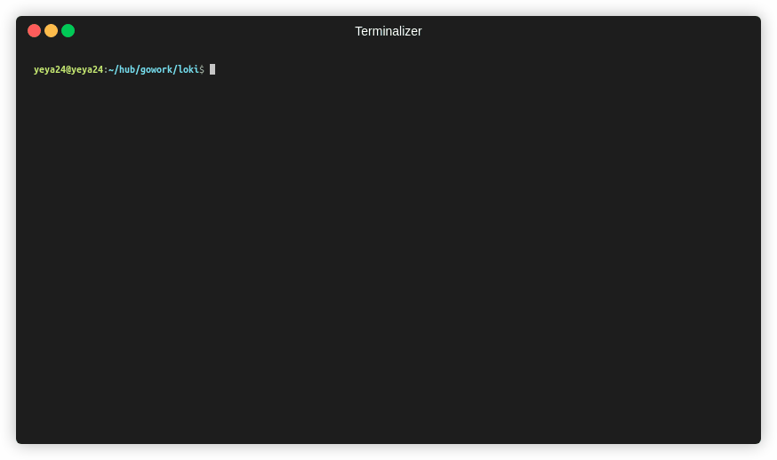

# promlinter

A linter for checking Prometheus metrics name via promlint.

Sorry Loki :(.



## Installation

### Go Get

go get github.com/yeya24/promlinter/cmd/promlinter

### Download from release

Please go to https://github.com/yeya24/promlinter/releases.

### Build from source

#### Requirements

- Go >= 1.13
- make

``` bash
git clone https://github.com/yeya24/promlinter.git
make build
```

Then you can find the `promlinter` binary file in the `./bin` directory.

## Usage

``` bash
usage: promlinter [<flags>] <command> [<args> ...]

Prometheus metrics linter for Go code.

This tool can cover most of the patterns of metrics naming issues, but it cannot detect metric values that can only be determined in the runtime.

By default it doesn't output parsing failures, if you want to see them, you can add --strict flag to enable it.

It is also supported to disable the lint functions using repeated flag --disable. Current supported functions are:

  [Help]: Help detects issues related to the help text for a metric.

  [MetricUnits]: MetricUnits detects issues with metric unit names.

  [Counter]: Counter detects issues specific to counters, as well as patterns that should only be used with counters.

  [HistogramSummaryReserved]: HistogramSummaryReserved detects when other types of metrics use names or labels reserved for use by histograms and/or summaries.

  [MetricTypeInName]: MetricTypeInName detects when metric types are included in the metric name.

  [ReservedChars]: ReservedChars detects colons in metric names.

  [CamelCase]: CamelCase detects metric names and label names written in camelCase.

  [UnitAbbreviations]: UnitAbbreviations detects abbreviated units in the metric name.

Flags:
  -h, --help     Show context-sensitive help (also try --help-long and --help-man).
      --version  Show application version.

Commands:
  help [<command>...]
    Show help.

  list [<flags>] [<files>...]
    List metrics name.

  lint [<flags>] [<files>...]
    Lint metrics via promlint.

```

## Run tests

``` bash
make test
```
